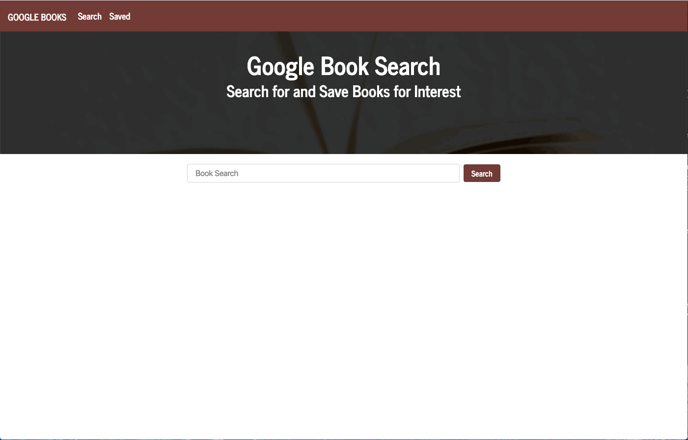
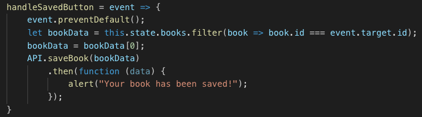

# Google Book Search

## Live Link

https://searchbooksandsave.herokuapp.com/

## Description 
User can search for books via the Google Books API that renders the books to the page. The user is given the option to either save the book or view the book. Saving a book stores the on the save book tab, where the user can again view or delete. The view link takes user to the Google Books site. 

## Demo

## Code Snippet

handleSavedButton is the onClick event for saving an article by capturing the books id from the Google API. 

## Technologies Used

- React
- React Router Dom 
- Javascript
- Express
- Mongoose
- axios
- CSS

## Challenges

- Connecting to mongoose
    - Solution: Fixing schema data types
- Deploying to Heroku
    - Solution: Moved the add routes below the static assets

## **Contributors**
 - Links to our Githubs
    - [Chris Hayashi](https://github.com/Chris-Hayashi)
    - [Dimple Shanbhag](https://github.com/dimz13)
    - [Shelby Reinsimar](https://github.com/shelbyreins)
